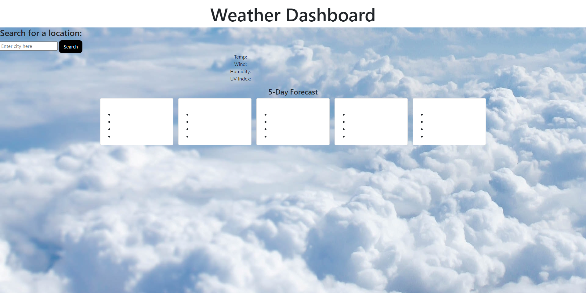

# WeatherDashboard

Homework 6: Weather Dashboard

 

## Description:

Weather Dashboard thats displays current weather details according to the city searched.

 

## Table of Contents:

- Installation
- Screenshots
- Credits
- How to Contribute
- Github URL
- Webpage URL

 

## Installation

click on <a href="https://brobrett.github.io/WeatherDashboard/" alt="weather dashboard github link">Weather Dashboard</a> to view Github.

 

## Screenshots

[Screenshot](./images/screenshot1.png)  "Home Page - Webpage displays header, searchbar, and 5 day forecast cards"

 

## Credits:

- I would like to thank my instructors Jackie and Dave for helping me on little things during office hours

 

## How to Contribute:

- Github Repo. is public. Please email me if you would like to contribute.

 

## Github URL

Click <a href="https://github.com/BroBrett/WeatherDashboard" alt="weather dashboard github link">here</a> to view Github repo.

 

Click <a href="https://brobrett.github.io/WeatherDashboard/" alt="weather dashboard webpage link">here</a> to view webpage.